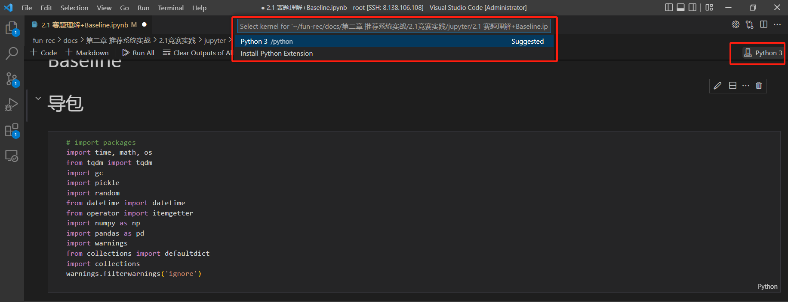
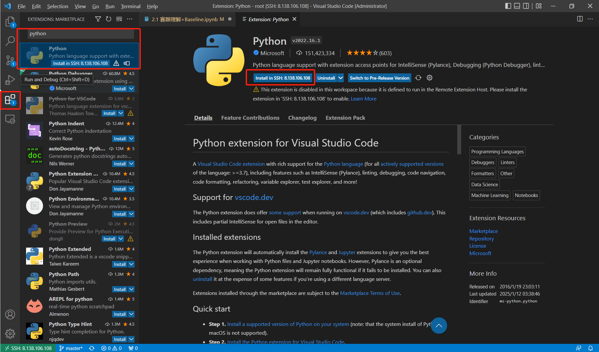
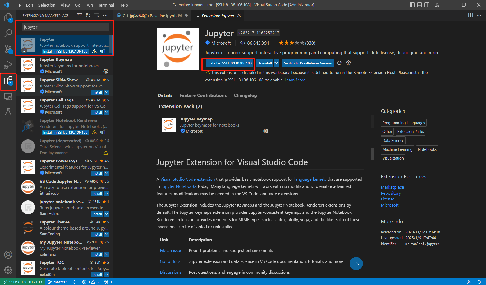
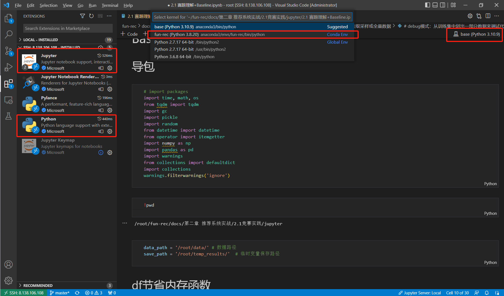
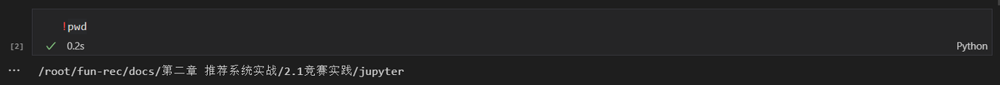
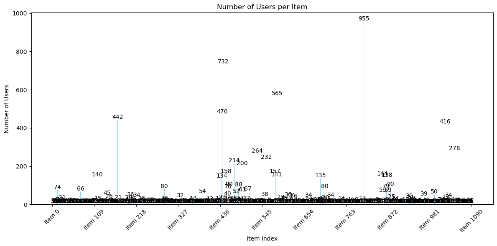
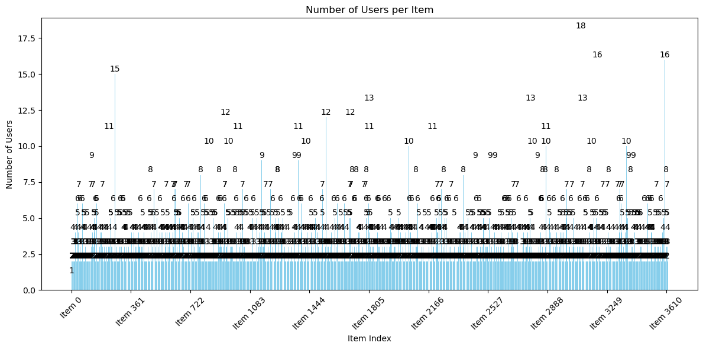
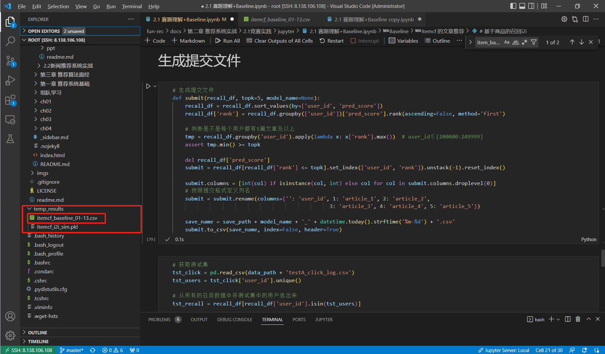
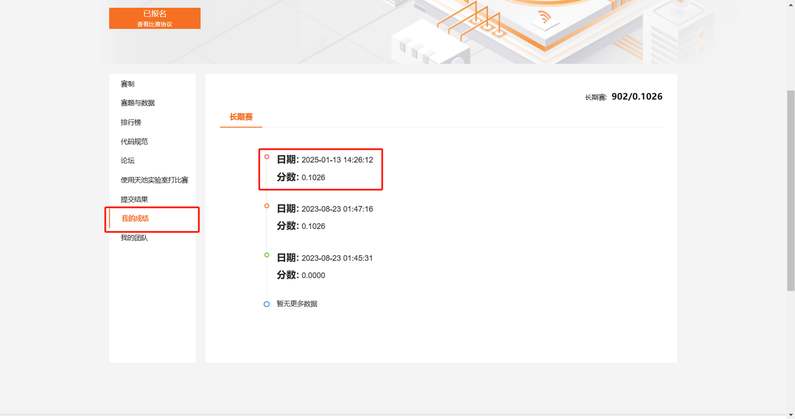

# fun-rec-tutorial

[fun-rec](https://github.com/datawhalechina/fun-rec) 代码实操指导手册


# 更新日志

- 2025年1月14日  
  完善baseline运行和解读

- 2025年1月11日  
  环境配置完整tutorial

- 2025年1月10日  
  环境配置（阿里ECS）+ Git仓库 + Data download操作说明


# Task1:Quick Start

## 1.链接开发机

下载Vscode


……


创建服务器

参考datwhale这篇：[https://github.com/datawhalechina/llm-universe/blob/main/notebook](https://github.com/datawhalechina/llm-universe/blob/main/notebook/C1%20%E5%A4%A7%E5%9E%8B%E8%AF%AD%E8%A8%80%E6%A8%A1%E5%9E%8B%20LLM%20%E4%BB%8B%E7%BB%8D/5.%E9%98%BF%E9%87%8C%E4%BA%91%E6%9C%8D%E5%8A%A1%E5%99%A8%E7%9A%84%E5%9F%BA%E6%9C%AC%E4%BD%BF%E7%94%A8.md)


安装git   

```bash
yum install git -y
```

进入Root路径克隆fun-rec仓库  
```
cd root
git clone https://github.com/datawhalechina/fun-rec.git
  
```


### 本地


#### conda

- 通过前边的操作我们已经拿到了工程项目的代码，但我们最好不是现在就去运行我们的程序，因为我们还没有导入本次代码用到的相关库，这也非常简单只需以下几步。
- Python环境千千万，为此我们需要用到conda来管理我们的Python环境。


- 请注意你只需要在最初的时候进行如下安装，重启阿里云服务器并不会清空我们的安装（前提是都放在了`/root`路径下）。
- 在上方菜单栏选择【Terminal - New Terminal】调出终端，输入运行以下命令（一次性复制粘贴过去）。

```Bash
# 切换到根目录
cd

# 下载安装包
wget https://repo.anaconda.com/archive/Anaconda3-2023.03-1-Linux-x86_64.sh

# 给该脚本权限
chmod +x Anaconda3-2023.03-1-Linux-x86_64.sh

# 执行脚本，等待时间较长
./Anaconda3-2023.03-1-Linux-x86_64.sh
  
```

- 看到这个页面，点击回车授权license。


- 接下来是相当于用户授权文件等等内容，这里一直回车即可，随后键盘输入`yes`进行确认。


- 这里指定安装路径，我们保持默认就可以了，输入回车键。


- 通常我们会来到这个页面，**强烈建议输入**`Yes`，如果你已经眼疾手快跳过了也没关系，接着往下看。


- 假如上一步已经填写了`Yes`直接跳过这一部分，如果没有输入或者输入了`No`则需要执行这一步。
- 正如我们在Windows安装软件需要添加`环境变量`，上一步相当于软件自动帮我们添加，假如错过了则需要我们手动进行添加，只不过流程也非常简单：

```Bash
# 映射路径
export PATH=$PATH:/root/anaconda3/bin/

# 启用环境
source ~/.bashrc
  
```

- 如果部署成功我们会看到前边的机器稍有变化，进入到了`base`环境也就是`conda`的环境大本营。
- 假如这一步没有显示`base`也请往下看。


- **假如上一步失败**没有出现`base`你需要做如下简单的补救：

1.输入以下指令，我们通过VI编辑器来添加

```Bash
vi ~/.bashrc
```

- 假如见到这个界面，直接回车进入即可  


2.光标点进文档内部进入VI编辑器的`指令`编辑模式，键盘输入`i`指令（代表Insert）也就是准备输入的意思。


3.务必在上述`Insert`中才能够将内容输入： 

```Bash
export PATH=$PATH:/root/anaconda3/bin/
```


4.接着按住键盘左上角（通常）的`Esc`键退出`Insert`编辑模式，回到`指令`编辑模式；操作过程请选择英文输入法而非中文输入法。

5.此时在键盘输入`:wq`注意在此处的冒号，随后回车即代表“保存并退出”。 


6.到这里代表我们手动把环境变量写入系统配置文件了，接下来我们还要让这个变量生效，运行下列代码：

```Bash
# 启用环境
source ~/.bashrc

# 初始化 conda 环境
conda init
  
```

7.这里提示我们进行重启，我们关闭当前终端重新打开（注意非重启开发机）到这里conda环境就彻底安装好啦！  


- 小概率情况，假如上一步失败没有看到base出现以下情况，我们这里继续补救下，已经看到的**直接跳过这部分**。


- 假如之前的配置没有成功，我们需要运行以下指令先把anaconda相关安装包删除掉，方便我们对其进行重新安装：

```Bash
# 切换到根目录
cd /root

# 删除安装包
rm -rf Anaconda3*
    
```

- 随后我们跳到最开始的【conda】部份重新走一遍安装流程，确保完成环境配置再往下进行。

8.到这里之前请确保你已经看到了`base`的环境字样。

9.最后一步是配置相关的源它可以让我们往后安装相关的Python库更加丝滑，这里推荐清华源；把下列代码在命令行框里边复制并运行。

```Bash
#添加镜像源
conda config --add channels https://mirrors.tuna.tsinghua.edu.cn/anaconda/pkgs/main
conda config --add channels https://mirrors.tuna.tsinghua.edu.cn/anaconda/pkgs/free
conda config --add channels https://mirrors.tuna.tsinghua.edu.cn/anaconda/pkgs/r
conda config --add channels https://mirrors.tuna.tsinghua.edu.cn/anaconda/pkgs/pro
conda config --add channels https://mirrors.tuna.tsinghua.edu.cn/anaconda/pkgs/msys2
 
#显示检索路径
conda config --set show_channel_urls yes
 
#显示镜像通道
conda config --show channels
  
```

- 看到这里就说明绝大部分环境工作已经完成啦！
- 到这里我们就把`Python管家`也就是`conda`安装好了，接下来就需要配置我们本次教程的专属环境啦。


- ……
- **待补充【创建****conda** **环境，安装requirement】**

```Bash
# 创建环境，名为 fun-rec
conda create --name fun-rec python=3.8 -y

# 生效并进入该环境
conda activate fun-rec

# 安装相关的依赖包
tqdm==4.67.1  
numpy==1.22.3  
pandas==1.4.1  
faiss-cpu==1.8.0  
scikit-learn==1.0.2  
deepctr==0.9.3  
tensorflow==2.2  
protobuf==3.20.0  
deepmatch==0.3.1
  
```


- 到这里运行所需的环境就全都配置好了。但需要注意的是每当我们重新打开终端时，都会进入conda大本营也就是`base`环境，故我们在运行相关代码或者命令行输入指令前，都想要进入我们定义好的`fun-rec`才能生效。


- 但我们在运行的时候需要指定对应的运行环境，conda帮助我们隔离每个环境以方便快速切换，这里我们需要选择刚刚创建的`fun-rec`虚拟环境。



- 发现我们在选择运行环境时找不到`fun-rec`，此时我们还需要一些步骤来确保我们的代码正确运行，在左边侧边栏处下载以下两个插件：Python和Jupyter。





- 点击右上方的`Select kernel`就能看到我们刚刚配置的`conda`环境了，选择`fun-rec`点击【Run All】就可以快乐玩耍啦!!!




### Web

暂略


## 2.下载数据

```bash
mkdir data
wget http://tianchi-competition.oss-cn-hangzhou.aliyuncs.com/531842/articles.csv
wget http://tianchi-competition.oss-cn-hangzhou.aliyuncs.com/531842/articles_emb.csv
wget http://tianchi-competition.oss-cn-hangzhou.aliyuncs.com/531842/testA_click_log.csv
wget http://tianchi-competition.oss-cn-hangzhou.aliyuncs.com/531842/train_click_log.csv
  
```


# Task2.跑通Baseline

> 接下来我们的任务是跑通`2.1 赛题理解+Baseline.ipynb`并且取得初步的结果。由于全量数据运行时间较长，因此我们在读取`all_click_df`的时候先进行降采样跑通整个流程，注意此时的提交文件并不能用于直接提交；我们需要在跑通流程后将全量数据读入`all_click_df`中再次跑通整个流程，并用生成的文件用于提交系统获得分数。全量数据完整跑通整个baseline文件大约60min

- 首先我们可以通过新建一个cell来使用`pwd`指令查看当前所在的路径；如果你对于这些路径还不熟悉也没关系，在后续使用中多记录多观察即可。


- 创建文件目录用于保存中间结果

```Bash
# 创建该目录，若已存在则跳过
!mkdir -p /root/temp_results/
```

- 修改对应路径

```Bash
data_path = '/root/data/' # 数据路径
save_path = '/root/temp_results/'  # 临时变量保存路径
```

- 关于工具函数`reduce_mem`的这段代码的作用是减少一个Pandas DataFrame的内存使用量。它通过将数据列转换为更小的数据类型来实现内存的节省。通过这种方式，可以有效地减少DataFrame的内存占用以避免数据溢出或截断，从而提高数据处理的效率和性能。

```Python
# 节约内存的一个标配函数
def reduce_mem(df):
    starttime = time.time()
    numerics = ['int16', 'int32', 'int64', 'float16', 'float32', 'float64']
    start_mem = df.memory_usage().sum() / 1024**2
    for col in df.columns:
        col_type = df[col].dtypes
        if col_type in numerics:
            c_min = df[col].min()
            c_max = df[col].max()
            if pd.isnull(c_min) or pd.isnull(c_max):
                continue
            if str(col_type)[:3] == 'int':
                if c_min > np.iinfo(np.int8).min and c_max < np.iinfo(np.int8).max:
                    df[col] = df[col].astype(np.int8)
                elif c_min > np.iinfo(np.int16).min and c_max < np.iinfo(np.int16).max:
                    df[col] = df[col].astype(np.int16)
                elif c_min > np.iinfo(np.int32).min and c_max < np.iinfo(np.int32).max:
                    df[col] = df[col].astype(np.int32)
                elif c_min > np.iinfo(np.int64).min and c_max < np.iinfo(np.int64).max:
                    df[col] = df[col].astype(np.int64)
            else:
                if c_min > np.finfo(np.float16).min and c_max < np.finfo(np.float16).max:
                    df[col] = df[col].astype(np.float16)
                elif c_min > np.finfo(np.float32).min and c_max < np.finfo(np.float32).max:
                    df[col] = df[col].astype(np.float32)
                else:
                    df[col] = df[col].astype(np.float64)
    end_mem = df.memory_usage().sum() / 1024**2
    print('-- Mem. usage decreased to {:5.2f} Mb ({:.1f}% reduction),time spend:{:2.2f} min'.format(end_mem,
                                                                                                   100*(start_mem-end_mem)/start_mem,
                                                                                                   (time.time()-starttime)/60))
    return df
```

## 读入数据

- 接下来这段代码是读取相应的数据集，注释里边也充分介绍了这些数据集分别对应哪个；
- 注意到这里`sample_nums`=10000也就是取其中的1w条数据用于跑通整个流程，这是快速开发的关键，避免了无效的算力和资源浪费在了调试的过程中；建议大家都学会这个思路事倍功半。
- 针对`debug模式`通过random.choice来对整体样本进行随机抽样，`replace=False`表示无放回抽样。

```Bash
# debug模式：从训练集中划出一部分数据来调试代码
def get_all_click_sample(data_path, sample_nums=100):
    """
        训练集中采样一部分数据调试
        data_path: 原数据的存储路径
        sample_nums: 采样数目（这里由于机器的内存限制，可以采样用户做）
    """
    trn_click = pd.read_csv(data_path + 'train_click_log.csv')
    tst_click = pd.read_csv(data_path + 'testA_click_log.csv')
    all_click = trn_click.append(tst_click)
    all_user_ids = all_click.user_id.unique()

    sample_user_ids = np.random.choice(all_user_ids, size=sample_nums, replace=False) 
    all_click = all_click[all_click['user_id'].isin(sample_user_ids)]
    
    all_click = all_click.drop_duplicates((['user_id', 'click_article_id', 'click_timestamp']))
    return all_click

# 读取点击数据，这里分成线上和线下，如果是为了获取线上提交结果应该讲测试集中的点击数据合并到总的数据中
# 如果是为了线下验证模型的有效性或者特征的有效性，可以只使用训练集
def get_all_click_df(data_path=data_path, offline=True):
    if offline:
        all_click = pd.read_csv(data_path + 'train_click_log.csv')
    else:
        trn_click = pd.read_csv(data_path + 'train_click_log.csv')
        tst_click = pd.read_csv(data_path + 'testA_click_log.csv')

        all_click = trn_click.append(tst_click)
    
    all_click = all_click.drop_duplicates((['user_id', 'click_article_id', 'click_timestamp']))
    return all_click
```

- 此处还考虑了一些异常样本，例如对`user_id`, `click_article_id`, `click_timestamp`有重复的样本，在本次赛事提供的数据中暂无此类数据；
- 只考虑`user_id`和`click_article_id`这两个列的情况，可以通过以下代码查看这两列异常样本，代码如下：

```Python
trn_click = pd.read_csv(data_path + 'train_click_log.csv')
tst_click = pd.read_csv(data_path + 'testA_click_log.csv')
all_click = trn_click.append(tst_click)

# 找到重复的行
duplicate_rows = all_click[all_click.duplicated(subset=['user_id', 'click_article_id'], keep=False)]
# 对重复的行进行排序
duplicate_rows = duplicate_rows.sort_values(by=['user_id', 'click_article_id'])
# 保存
duplicate_rows.to_csv('/root/duplicate_rows.csv', index=False, header=True)

# # 查看重复的样本
print(duplicate_rows)
```

- 看到数据如下。此处可以看到存在一些样本，他们的`user_id`和`clikc_article_id`都是相同的；假如有一条样本的`user_id、clikc_article_id`和`click_timestamp`都相同我们应当将其过滤掉，这与常识相吻合。

```Bash
         user_id  click_article_id  click_timestamp  click_environment  \
1106913      697             87194    1508200681205                  4   
1109003      697             87194    1508203193400                  4   
1106914      697            234698    1508200711205                  4   
1109002      697            234698    1508203163400                  4   
1100811     1398            342473    1508194827310                  4   
...          ...               ...              ...                ...   
198475    249933            202493    1507144765830                  4   
156       249937             49204    1507312409841                  4   
320324    249937             49204    1507552103311                  4   
178070    249999            233717    1507117257497                  4   
188451    249999            233717    1507133510213                  4   

         click_deviceGroup  click_os  click_country  click_region  \
1106913                  3         2              1            25   
1109003                  3         2              1            25   
1106914                  3         2              1            25   
1109002                  3         2              1            25   
1100811                  3         2              1            25   
...                    ...       ...            ...           ...   
198475                   1        17              1            13   
156                      1        17              1            21   
320324                   1        17              1            21   
178070                   1        17              1            13   
188451                   1        17              1            13   
...
178070                     2  
188451                     2  

[25092 rows x 9 columns]
```

- 另外一个重要的步骤就是了解我们的数据长什么样子。可以看到这个数据有如下一些列名：

  - > ['user_id', 'click_article_id', 'click_timestamp', 'click_environment', 'click_deviceGroup', 'click_os', 'click_country', 'click_region', 'click_referrer_type']

  - 注意`articles_emb`存储的是多条dim=250的向量；

  - |        **Field**        |         **Description**          |   **value**   |
    | :---------------------: | :------------------------------: | :-----------: |
    |         user_id         |               用户               |     id697     |
    |    click_article_id     |            点击文章id            |     87194     |
    |     click_timestamp     |            点击时间戳            | 1508200681205 |
    |    click_environment    |             点击环境             |       4       |
    |    click_deviceGroup    |            点击设备组            |       3       |
    |        click_os         |           点击操作系统           |       2       |
    |      click_country      |             点击城市             |       1       |
    |      click_region       |             点击地区             |      25       |
    |   click_referrer_type   |           点击来源类型           |       4       |
    |                         |                                  |               |
    |       article_id        | 文章id，与click_article_id相对应 |       0       |
    |       category_id       |            文章类型id            |       0       |
    |      created_at_ts      |          文章创建时间戳          | 1513144419000 |
    |       words_count       |             文章字数             |      168      |
    |                         |                                  |               |
    | emb_1,emb_2,...,emb_249 |      文章embedding向量表示       |               |

  - 数据的前两条长这样，可以看出来已经归一化到∈[-1,1]之间的值，具体怎么读取和处理这种向量值可以参考`Task4.多路召回版块`；

    | article_id | emb_0     | emb_1     | emb_2     | ……   | emb_247   | emb_248  | emb_249   |
    | ---------- | --------- | --------- | --------- | ---- | --------- | -------- | --------- |
    | 0          | -0.161183 | -0.957233 | -0.137944 | ……   | -0.231686 | 0.597416 | 0.409623  |
    | 1          | -0.523216 | -0.974058 | 0.738608  | ……   | 0.182828  | 0.39709  | -0.834364 |
    | ……         |           |           |           |      |           |          |           |


## 协同过滤itemCF

- 我们首先需要了解什么是itemCF。

> 1. 预先根据所有用户的历史行为数据，计算物品之间的相似性。
> 2. 然后，把与用户喜欢的物品相类似的物品推荐给用户。

### user_item_time_dict

- 通过前边章节《[itemCF编程实现](https://datawhalechina.github.io/fun-rec/#/ch02/ch2.1/ch2.1.1/itemcf)》的学习，我们了解到基于物品的协同过滤算法（itemCF）就是预先根据用户的历史行为数据，去计算物品之间的相似性。

> 举例来说，如果用户 1 喜欢物品 A ，而物品 A 和 C 非常相似，则可以将物品 C 推荐给用户1。ItemCF算法并不利用物品的内容属性计算物品之间的相似度， 主要通过分析用户的行为记录计算物品之间的相似度， 该算法认为， 物品 A 和物品 C 具有很大的相似度是因为喜欢物品 A 的用户极可能喜欢物品 C。

- 在工业场景中由于“交互”行为的**稀疏**，我们使用**字典**形式来存储物品-用户交互行为，能够大大节省存储成本；试想如果是一个二维数组而数组中绝大部分都是0（或者默认值）则会导致巨大的存储成本并且检索效率非常低。
- 通过前边章节《[itemCF编程实现](https://datawhalechina.github.io/fun-rec/#/ch02/ch2.1/ch2.1.1/itemcf)》的实践，我们了解到itemCF实际要做的就是完成相似度矩阵的计算，而这个相似度矩阵**通常**是由两层for循环去检索一个字典，也就是：

```Python
# 遍历每条物品-用户评分数据
for i1, users1 in item_data.items():
    for i2, users2 in item_data.items():
        ……
```

```Python
item_data:

{'A': {'Alice': 5.0, 'user1': 3.0, 'user2': 4.0, 'user3': 3.0, 'user4': 1.0},
 'B': {'Alice': 3.0, 'user1': 1.0, 'user2': 3.0, 'user3': 3.0, 'user4': 5.0},
 'C': {'Alice': 4.0, 'user1': 2.0, 'user2': 4.0, 'user3': 1.0, 'user4': 5.0},
 'D': {'Alice': 4.0, 'user1': 3.0, 'user2': 3.0, 'user3': 5.0, 'user4': 2.0},
 'E': {'user1': 3.0, 'user2': 5.0, 'user3': 4.0, 'user4': 1.0}}
```

- 对于上边的`item_data`是关于`item_user_score`的嵌套字典，让我们来看看具体怎么定义的

> 外层字典
>
> - **键（Key）**：字符串类型，表示不同的项目或类别，例如 `'A'`、`'B'`、`'C'`、`'D'`、`'E'`。
> - **值（Value）**：每个键对应的值都是一个内层字典，表示与该键相关的数据。
>
> 内层字典
>
> - **键（Key）**：字符串类型，表示不同的用户或实体，例如 `'Alice'`、`'user1'`、`'user2'`、`'user3'`、`'user4'`。
> - **值（Value）**：浮点数类型，表示每个用户对相应项目的评分或某种度量值。

- 工业数据一个最大不同点在于用户并不会直接打分得到`score`，而必须自己定义；这也是计算的重点，**即该如何表征用户感兴趣的程度**。

- 本次赛题提供了时间戳信息`click_timestamp`表征发生点击行为和其具体时间，我们将其用于itemCF相似矩阵的计算当中

```Python
# 根据点击时间获取文章的点击用户序列   {item1: [(user1, time1), (user2, time2)..],...}
def get_item_user_time(click_df):   
    click_df = click_df.sort_values('click_timestamp')
    def make_user_time_pair(df):
        return list(zip(df['user_id'], df['click_timestamp']))
    item_user_time_df = click_df.groupby('click_article_id')['user_id', 'click_timestamp'].apply(lambda x: make_user_time_pair(x))\
                                                            .reset_index().rename(columns={0: 'user_time_list'})
    item_user_time_dict = dict(zip(item_user_time_df['click_article_id'], item_user_time_df['user_time_list']))
    return item_user_time_dict
```

- 定义一个辅助函数`make_user_time_pair`，将输入的 `df` 中的用户ID和点击时间列，打包成一个二元组列表。重点是搞清楚输入是什么，输出是什么；该函数输入是一个名为`click_df`的Dataframe，输出是一个嵌套字典。外层字典的`key`值是`click_article_id`，内层字典是对应的`user_id`和`click_timestamp`也就是说这个`item`在哪个时间点被哪些人点击的信息，只不过换成了字典方式来存储（因为字典查询速度更快）。
  - **`groupby`** **分组**：根据文章ID (`click_article_id`) 进行分组。
  - **提取字段**：每组中提取 `user_id` 和 `click_timestamp` 列。
  - **生成用户-时间对**：对每组数据调用 `make_user_time_pair` 函数，生成对应的用户-时间对列表。
  - **重置索引**：将分组后的索引重置为普通列，生成一个新的数据框。
  - **重命名列**：将生成的列表列命名为 `user_time_list`，最终数据框 `item_user_time_df` 的结构为：
  - ```Python
    click_article_id      user_time_list
    156624               [(196928, 1507035338092)]
    156560               [(196928, 1507035368092), (196144, 1507037486854)]
    161409               [(196144, 1507037516854)]
    ```

  - 使用 `zip` 将 `item_user_time_df` 的 `click_article_id` 和 `user_time_list` 列打包成键值对。
  - 转换为字典 `item_user_time_dict`，结构如：
    ```Python
    {
        156624: [(196928, 1507035338092)],
        156560: [(196928, 1507035368092), (196144, 1507037486854)],
        161409: [(196144, 1507037516854)]
    }
    ```
- 这里需要提到针对**双层嵌套**的字典大致常见的有两种表达方式，第一种跟《[itemCF编程实现](https://datawhalechina.github.io/fun-rec/#/ch02/ch2.1/ch2.1.1/itemcf)》思路一致即`item_user_time_dict={item1: [(user1, time1), (user2, time2)..],...}`；
  - 我们把横轴设为外层dict的`key=[item1, item2, item3, ……]`，纵轴设为内层中在该key下有多少的`key-value`对进行绘制，取1w条训练集数据得到如下图象；
  - 可以看到item被点击数的方差特别大，存在头部item的点击数特别大，但绝大部分item的点击数特别小，其中有62%的item点击数为1。
- 第二种思路则是`get_user_item_time={user1: [(item1, time1), (item2, time2)..]...}`；
  
  - 同样绘制出来，可以看到不同user点击数相较没那么大，活跃user的点击数也小于50，其中99%的user其点击数都小于等于10次点击。

```Python
# 根据点击时间获取用户的点击文章序列   {user1: [(item1, time1), (item2, time2)..]...}
def get_user_item_time(click_df):
    click_df = click_df.sort_values('click_timestamp')
    def make_item_time_pair(df):
        return list(zip(df['click_article_id'], df['click_timestamp']))
 user_item_time_df = click_df.groupby('user_id')['click_article_id', 'click_timestamp'].apply(lambda x: make_item_time_pair(x))\
                                                            .reset_index().rename(columns={0: 'item_time_list'})
    user_item_time_dict = dict(zip(user_item_time_df['user_id'], user_item_time_df['item_time_list']))  
    return user_item_time_dict
```

- 针对`item_user_time_dict`



- 针对`user_item_time_dict`



- 两种方式都能计算得到itemCF的相似矩阵，我们这里选择的是第二种方案也就是`user_item_time_dict`的方案；


### itemcf_sim

- 接下来看下`itemcf_sim`函数的主要作用，同样分析他的输入与输出，输入是`click_df`其类型为`Dataframe`；通过前边的分析我们很容易得到输入的这个`click_df`会首先输入函数`get_user_item_time`中得到一个`双层嵌套`字典；

```Python
# 获取用户点击文章的时间序列
user_item_time_dict = get_user_item_time(df)
```

- 接着初始化一个空字典 `i2i_sim`，用于存储文章之间的相似度；
- 使用 `collections` 模块中的 `defaultdict` 初始化一个默认值为整数的字典 `item_cnt`，用于记录每个文章被点击的次数。

```Python
#初始化相似度矩阵和计数器
i2i_sim = {}
item_cnt = defaultdict(int)
```

- 接着就是就是在一个`双层嵌套`字典中计算不同`item`的相似度，相似度具体怎么算；
- 就是遍历**这个用户**点击的文章列表，对于每对不同的文章 `i` 和 `j`，计算它们之间的相似度。相似度的计算方法是将1除以点击文章列表长度的对数（加1是为了避免对数为0的情况），然后累加到 `i2i_sim[i][j]` 中。
- 这里需要先理解`setdefault(key, value)`的用法，举个例子：
  - 当键 `'key1'` 不存在于字典 `my_dict` 中时，调用 `my_dict.setdefault('key1', 'value1')` 会将 `'key1'` 和 `'value1'` 插入到字典中，并返回 `'value1'`。
  - 当键 `'key1'` 已经存在于字典中时，再次调用 `my_dict.setdefault('key1', 'value2')` 不会改变字典中 `'key1'` 对应的值，仍然返回 `'value1'`。
  - 当键 `'key2'` 不存在于字典中时，调用 `my_dict.setdefault('key2', 'value3')` 会将 `'key2'` 和 `'value3'` 插入到字典中，并返回 `'value3'`。

```Python
# 创建一个空字典
my_dict = {}

# 使用setdefault方法获取键'key1'的值，如果'key1'不存在，则设置默认值为'value1'
value = my_dict.setdefault('key1', 'value1')

# 输出字典和获取的值
print(my_dict)  # 输出: {'key1': 'value1'}
print(value)    # 输出: value1

# 再次使用setdefault方法获取键'key1'的值，此时'key1'已存在，返回其对应的值
value = my_dict.setdefault('key1', 'value2')

# 输出字典和获取的值
print(my_dict)  # 输出: {'key1': 'value1'}
print(value)    # 输出: value1

# 使用setdefault方法获取键'key2'的值，如果'key2'不存在，则设置默认值为'value3'
value = my_dict.setdefault('key2', 'value3')

# 输出字典和获取的值
print(my_dict)  # 输出: {'key1': 'value1', 'key2': 'value3'}
print(value)    # 输出: value3
```

- 有了上边的例子接着看下边代码，就清晰很多了：

```Python
# 先简单放一个user_item_time_dict

{user1:[(item1, time1),(item2, time2)],
 user2:[(item3, time3)],
 ……
 user3:[(item4, time4)]}
 
{4163: [(289003, 1508171236976),
  (283009, 1508171484271),
  (30389, 1508171514271),
  (156807, 1508179991575),
  (352979, 1508180070348),
  (73506, 1508180378138),
  (119189, 1508180701156),
  (237385, 1508181231773),
  (342473, 1508181261773)],
 11211: [(209236, 1508102402099), (202559, 1508102432099)],
 11880: [(298599, 1508098381403),
  (331116, 1508098435569),
  (199372, 1508098571314),
  (218028, 1508098601314)],
...
  (162655, 1507066855756),
  (107216, 1507175169233),
  (284312, 1507175199233),
  (156625, 1507225274677),
  (156963, 1507225304677)]}
# 外层(第一层)嵌套，如果key中存在i则返回对应的value，否则返回全新一个空字典(内层)
i2i_sim.setdefault(i, {})
# 内层(第二层)嵌套，如果key中存在i则返回对应的value，否则返回数值0(对应value)
i2i_sim[i].setdefault(j, 0)
```

- 这个时候再看回来整体，他的作用其实就是在一个`双层嵌套`字典中计算不同`item`的相似度，相似度的分子就是简单进行计数，分母不是简单除以`len(item_time_list)`而是取对数的处理；同时还通过`单层字典`记录物品出现次数。

```Python
# 计算物品相似度
for user, item_time_list in tqdm(user_item_time_dict.items()):
    # 在基于商品的协同过滤优化的时候可以考虑时间因素
    for i, i_click_time in item_time_list:
        item_cnt[i] += 1
        i2i_sim.setdefault(i, {})
        for j, j_click_time in item_time_list:
            if(i == j):
                continue
            i2i_sim[i].setdefault(j, 0)
            i2i_sim[i][j] += 1 / math.log(len(item_time_list) + 1)
```

- 到这里得到物品相似矩阵`i2i_sim`也就是

```Python
{item1:{item2:score},
 item3:{item4:score,
        item5:score,
        item6:score},
  ……
 item7:{item8:score}}

{4163: [(289003, 1508171236976),
  (283009, 1508171484271),
  (30389, 1508171514271),
  (156807, 1508179991575),
  (352979, 1508180070348),
  (73506, 1508180378138),
  (119189, 1508180701156),
  (237385, 1508181231773),
  (342473, 1508181261773)],
 11211: [(209236, 1508102402099), (202559, 1508102432099)],
 11880: [(298599, 1508098381403),
  (331116, 1508098435569),
  (199372, 1508098571314),
  (218028, 1508098601314)],
...
  (162655, 1507066855756),
  (107216, 1507175169233),
  (284312, 1507175199233),
  (156625, 1507225274677),
  (156963, 1507225304677)]}
```

- 这里的`i2i_sim_`是用了第二种计算方式，也就是分母使用的是`item_i`与`item_j`出现次数的乘积

```Python
i2i_sim_[i][j] = wij / math.sqrt(item_cnt[i] * item_cnt[j])
```

- 得到不一样的`i2i_sim`相似矩阵

```Python
{289003: {283009: 0.43429448190325176,
  30389: 0.43429448190325176,
  156807: 0.43429448190325176,
  352979: 0.43429448190325176,
  73506: 0.43429448190325176,
  119189: 0.43429448190325176,
  237385: 0.43429448190325176,
  342473: 0.43429448190325176},
 283009: {289003: 0.43429448190325176,
  30389: 0.43429448190325176,
  156807: 0.43429448190325176,
  352979: 0.43429448190325176,
  73506: 0.43429448190325176,
  119189: 0.43429448190325176,
  237385: 0.43429448190325176,
  342473: 0.43429448190325176},
 30389: {289003: 0.43429448190325176,
  283009: 0.43429448190325176,
  156807: 0.43429448190325176,
  352979: 0.43429448190325176,
  73506: 0.43429448190325176,
  119189: 0.43429448190325176,
  237385: 0.43429448190325176,
  342473: 0.43429448190325176},
 156807: {289003: 0.43429448190325176,
...
 156963: {156622: 0.5138983423697507,
  162655: 0.5138983423697507,
  107216: 0.5138983423697507,
  284312: 0.5138983423697507,
  156625: 0.5138983423697507}}
```


### get_item_topk_click

> 定义了一个名为 `get_item_topk_click` 的函数，其目的是从给定的数据表中获取点击次数最多的前 `k` 篇文章。

- `click_df['click_article_id']`：从 `click_df` DataFrame 中选择 `click_article_id` 列，该列包含所有点击事件的文章ID。
- `.value_counts()`：对 `click_article_id` 列中的值进行计数，返回一个 Series，其中索引是文章ID，值是每个文章ID出现的次数（即点击次数），并且自动按照点击次数降序排序。
- `.index[:k]`：获取排序后的 Series 的前 `k` 个索引，即点击次数最多的前 `k` 篇文章的ID。

```Python
# 获取近期点击最多的文章
def get_item_topk_click(click_df, k):
    topk_click = click_df['click_article_id'].value_counts().index[:k]
    return topk_click
```


### item_based_recommend

- 接着我们可以针对每个`user`的历史点击记录，根据上述的相似矩阵`i2i_sim`、高热item列表`item_topk_click`和相关参数给出对应的`item`推荐列表。
- 最终的推荐结果也是放在字典`user_recall_items_dict`里边，key是用户名，value是推荐结果；
- 而确定推荐结果靠的是由函数`item_based_recommend`来完成的。

```Python
# 定义
user_recall_items_dict = collections.defaultdict(dict)

# 获取 用户 - 文章 - 点击时间的字典
user_item_time_dict = get_user_item_time(all_click_df)

# 去取文章相似度
i2i_sim = pickle.load(open(save_path + 'itemcf_i2i_sim.pkl', 'rb'))

# 相似文章的数量
sim_item_topk = 10

# 召回文章数量
recall_item_num = 10

# 用户热度补全
item_topk_click = get_item_topk_click(all_click_df, k=50)

for user in tqdm(all_click_df['user_id'].unique()):
    user_recall_items_dict[user] = item_based_recommend(user, user_item_time_dict, i2i_sim, 
                                                        sim_item_topk, recall_item_num, item_topk_click)
```

> 定义了一个名为 `item_based_recommend` 的函数，其目的是基于物品协同过滤算法为特定用户进行文章召回

- 该函数接受六个参数：`user_id`（用户ID）、`user_item_time_dict`（用户点击文章序列的字典）、`i2i_sim`（文章相似性矩阵）、`sim_item_topk`（选择与当前文章最相似的前k篇文章）、`recall_item_num`（最后的召回文章数量）、`item_topk_click`（点击次数最多的文章列表）。

```Python
def item_based_recommend(user_id, user_item_time_dict, i2i_sim, sim_item_topk, recall_item_num, item_topk_click):"""
        基于文章协同过滤的召回
        :param user_id: 用户id
        :param user_item_time_dict: 字典, 根据点击时间获取用户的点击文章序列   {user1: [(item1, time1), (item2, time2)..]...}
        :param i2i_sim: 字典，文章相似性矩阵
        :param sim_item_topk: 整数， 选择与当前文章最相似的前k篇文章
        :param recall_item_num: 整数， 最后的召回文章数量
        :param item_topk_click: 列表，点击次数最多的文章列表，用户召回补全

        return: 召回的文章列表 {item1:score1, item2: score2...}
        注意: 基于物品的协同过滤(详细请参考上一期推荐系统基础的组队学习)， 在多路召回部分会加上关联规则的召回策略
    """
```

- 从 `user_item_time_dict` 中获取指定 `user_id` 的用户历史点击文章序列，存储在 `user_hist_items` 中。
- 使用列表解析和集合推导式创建一个集合 `user_hist_items_`，包含用户历史点击的所有文章ID。

```Python
# 获取用户历史交互的文章
user_hist_items = user_item_time_dict[user_id]
user_hist_items_ = {item_id for item_id, _ in user_hist_items}
# user_hist_items_ 
{299841, 299170, 198659, 284547, 284901, 298599, 240233, 235230, 272143, 156560, 286128, 297906, 300470, 162809, 129434, 199198}
```

- 初始化一个空字典 `item_rank`，用于存储召回文章及其得分。
- 遍历用户历史点击的文章序列 `user_hist_items`，对于每篇文章 `i`，获取其在文章相似性矩阵 `i2i_sim` 中的相似文章列表，并按照相似度 `wij` 降序排序。
- 选择与当前文章 `i` 最相似的前 `sim_item_topk` 篇文章，对于每篇相似文章 `j`，如果它不在用户历史点击的文章集合 `user_hist_items_` 中，则将其添加到 `item_rank` 中，并累加其相似度得分 `wij`。

```Python
# 计算召回文章的得分
item_rank = {}
for loc, (i, click_time) in enumerate(user_hist_items):
    for j, wij in sorted(i2i_sim[i].items(), key=lambda x: x[1], reverse=True)[:sim_item_topk]:
        if j in user_hist_items_:
            continue
                
        item_rank.setdefault(j, 0)
        item_rank[j] +=  wij
# item_rank
{273395: 0.26111287778149245, 276946: 0.26111287778149245, 58606: 0.26111287778149245, 114402: 0.26111287778149245, 235870: 0.26111287778149245, 234698: 0.26111287778149245, 95716: 0.26111287778149245, 59400: 0.26111287778149245, 336220: 0.26111287778149245}
```

- 可以看到上述推荐结果只有9个`item`，假如每个人要求至少推荐10个`item`那么就需要从“候补池”里边至少再抽取1个`item`；而这个“候选池”就来自于前边通过函数`get_item_topk_click`得到的高点击结果。

- 如果召回的文章数量不足 `recall_item_num`，则使用点击次数最多的文章列表 `item_topk_click` 进行补全。
- 遍历 `item_topk_click`，对于每个热门文章 `item`，如果它不在 `item_rank` 中，则将其添加到 `item_rank` 中，并赋予一个负数得分（例如 `-i - 100`），以确保其在后续排序中排在最后。
- 当召回文章数量达到 `recall_item_num` 时，停止补全。

```Python
if len(item_rank) < recall_item_num:
    for i, item in enumerate(item_topk_click):
        if item in item_rank.items(): # 填充的item应该不在原来的列表中
            continue
        item_rank[item] = - i - 100 # 随便给个负数就行
        if len(item_rank) == recall_item_num:
            break
```


### Submit

- `recall_df = recall_df.sort_values(by=['user_id', 'pred_score'])`：按照 `user_id` 和 `pred_score` 对 `recall_df` 进行排序，确保每个用户的推荐文章按照预测分数降序排列。
- `recall_df['rank'] = recall_df.groupby(['user_id'])['pred_score'].rank(ascending=False, method='first')`：为每个用户的推荐文章分配排名，排名是根据 `pred_score` 降序计算的，`method='first'` 表示在遇到相同分数时，按照出现的顺序分配排名。

```Python
recall_df = recall_df.sort_values(by=['user_id', 'pred_score'])
recall_df['rank'] = recall_df.groupby(['user_id'])['pred_score'].rank(ascending=False, method='first')
```

- 这里检查每个用户是否有至少 `topk` 个item；
- 注意前边其实预留了余量，举例说明，每个`user`都确保召回了10篇笔记，这里只取`topk=5`

```Python
tmp = recall_df.groupby('user_id').apply(lambda x: x['rank'].max())
assert tmp.min() >= topk
```

- `del recall_df['pred_score']`：删除 `recall_df` 中的 `pred_score` 列，因为后续不再需要预测分数。
- `recall_df[recall_df['rank'] <= topk]`：筛选出排名在 `topk` 以内的推荐文章。
- `.set_index(['user_id', 'rank'])`：将 `user_id` 和 `rank` 设置为索引。
- `.unstack(-1)`：将 `rank` 索引转换为列，形成宽格式的 DataFrame。
- `.reset_index()`：重置索引，将 `user_id` 和 `rank` 转换回普通列。

```Python
del recall_df['pred_score']
submit = recall_df[recall_df['rank'] <= topk].set_index(['user_id', 'rank']).unstack(-1).reset_index()
```

- `submit.columns = [int(col) if isinstance(col, int) else col for col in submit.columns.droplevel(0)]`：对列名进行处理，将整数类型的列名转换为整数，其他列名保持不变。
- `submit = submit.rename(columns={'': 'user_id', 1: 'article_1', 2: 'article_2', 3: 'article_3', 4: 'article_4', 5: 'article_5'})`：重命名列，使其符合提交文件的格式要求。

```Python
submit.columns = [int(col) if isinstance(col, int) else col for col in submit.columns.droplevel(0)]
submit = submit.rename(columns={'': 'user_id', 1: 'article_1', 2: 'article_2', 
                                3: 'article_3', 4: 'article_4', 5: 'article_5'})
```

- 最终得到的`submit`数据如下：

```Python
   user_id  article_1  article_2  article_3  article_4  article_5
0   208971     273395     276946      58606     114402     235870
1   224117     272143     156560      42693     300470     284901
```


## 提交submit

- 完整运行完之后，在`save_path`的路径下可以看到有结果文件生成，这里会结合当天日期对其进行命名，例如`itemcf_baseline_01-13.csv`。



- 前往新闻推荐[比赛官网](https://tianchi.aliyun.com/competition/entrance/531842/submission/737)，上传上图提到的`itemcf_baseline_01-13.csv`结果进行提交；


- 稍后可以在`我的成绩`查看成绩




- 到这里`Task2.跑通Baseline`就完成啦。