# fun-rec-tutorial

[fun-rec](https://github.com/datawhalechina/fun-rec) 代码实操指导手册


# 更新日志


- 2025年1月10日  
环境配置（阿里ECS）+ Git仓库 + Data download操作说明

- 2025年1月11日  
  环境配置完整tutorial


# Task1:Quick Start

## 1.链接开发机

下载Vscode


创建服务器

参考datwhale这篇：[https://github.com/datawhalechina/llm-universe/blob/main/notebook](https://github.com/datawhalechina/llm-universe/blob/main/notebook/C1%20%E5%A4%A7%E5%9E%8B%E8%AF%AD%E8%A8%80%E6%A8%A1%E5%9E%8B%20LLM%20%E4%BB%8B%E7%BB%8D/5.%E9%98%BF%E9%87%8C%E4%BA%91%E6%9C%8D%E5%8A%A1%E5%99%A8%E7%9A%84%E5%9F%BA%E6%9C%AC%E4%BD%BF%E7%94%A8.md)


安装git   

```bash
yum install git -y
```

进入Root路径克隆fun-rec仓库  
```
cd root
git clone https://github.com/datawhalechina/fun-rec.git

```

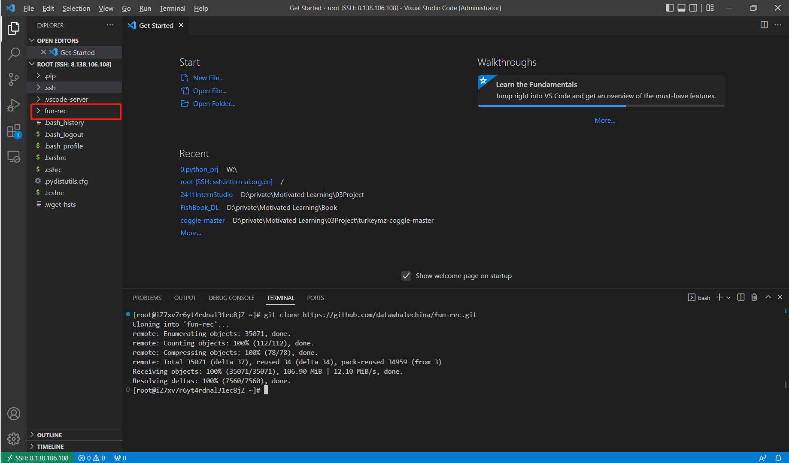


### 本地

- 通过Vscode远程连接服务器（方便可视化Jupyter Notebook）
- 左侧插件搜索【Jupyter】Install in SSH：xxx.xxx.xxx.xxx

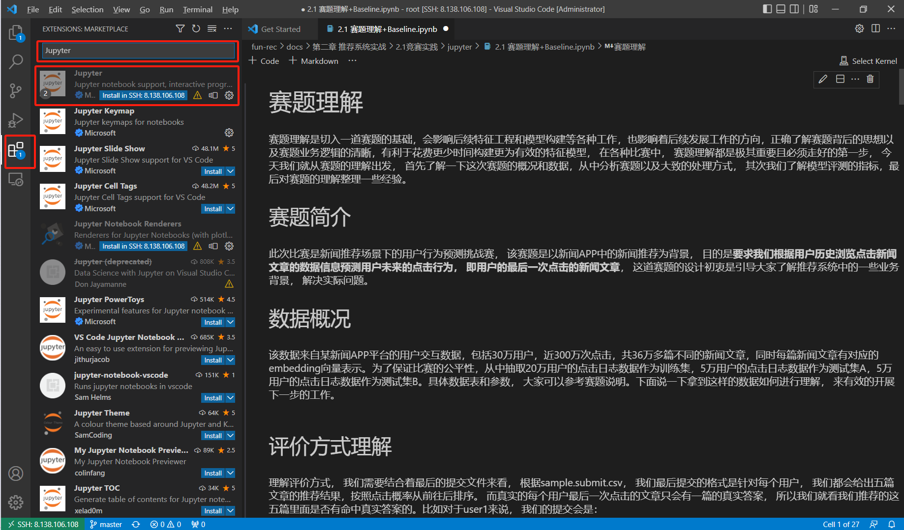

- 安装过后可以看到右侧的Notebook上方多了些可供运行的按钮，这给运行和调试Notebook代码提供了巨大便利。
- 按照左侧路径打开第一个Jupter Notebook。

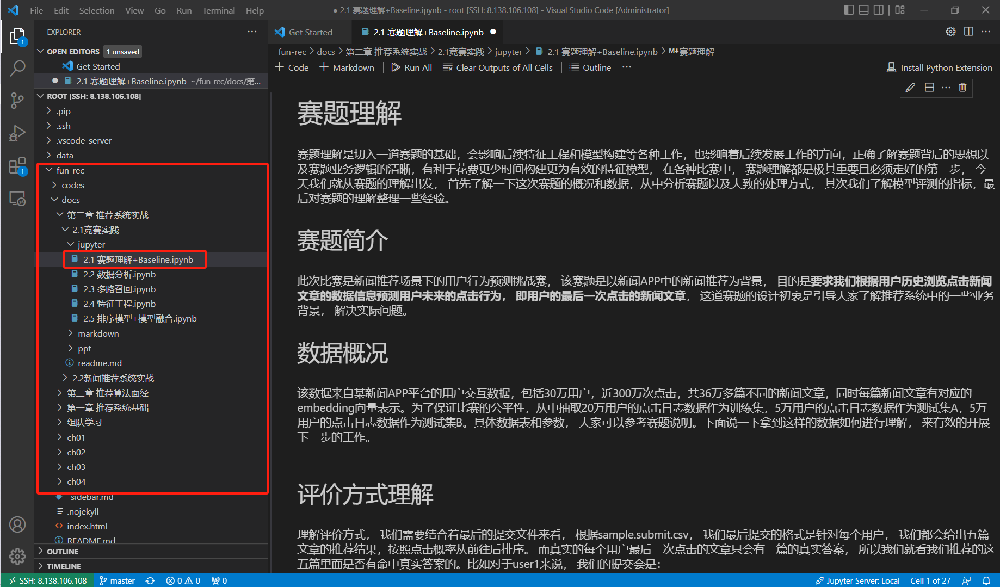

- 点击Run All，安装相关插件。

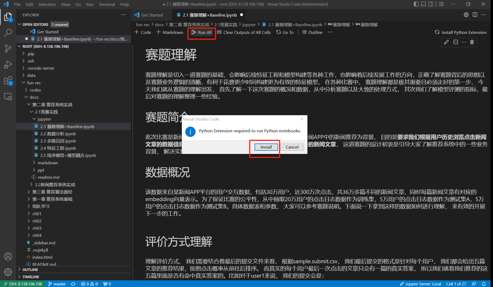

- 如果这里显示安装失败，建议可以先把【实例】进行重启。

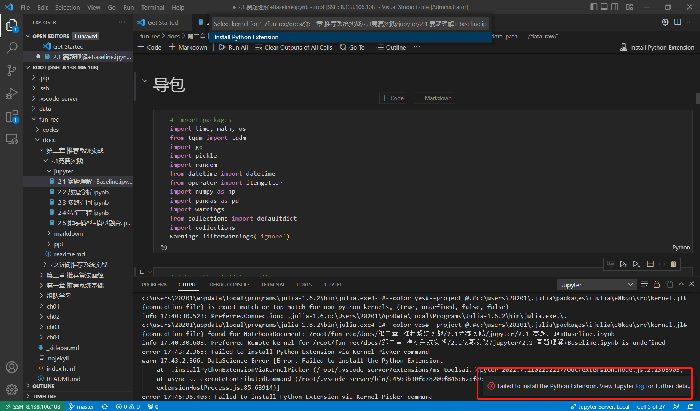


#### conda

- 可以看到右边这里已经是有Python的标识了，但我们最好不是现在就去运行我们的程序，因为我们还没有导入本次代码用到的相关库，这也非常简单只需以下几步。Python环境千千万，为此我们需要用到conda来管理我们的Python环境。
- 请注意你只需要在最初的时候进行如下安装，重启阿里云服务器并不会清空我们的安装（前提是都放在了`/root`路径下）。

```Bash
# 切换到根目录
cd

# 下载安装包
wget https://repo.anaconda.com/archive/Anaconda3-2023.03-1-Linux-x86_64.sh

# 给该脚本权限
chmod +x Anaconda3-2023.03-1-Linux-x86_64.sh

# 执行脚本，等待时间较长
./Anaconda3-2023.03-1-Linux-x86_64.sh

```

- 看到这个页面，点击回车授权license。

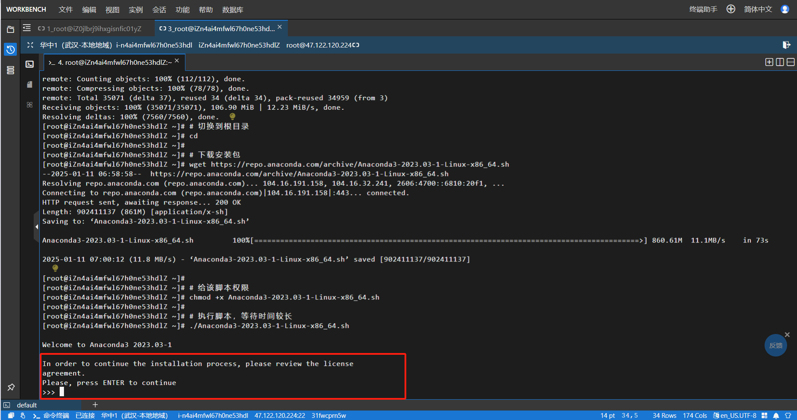

- 接下来是相当于用户授权文件等等内容，这里一直回车即可，随后键盘输入`yes`进行确认。

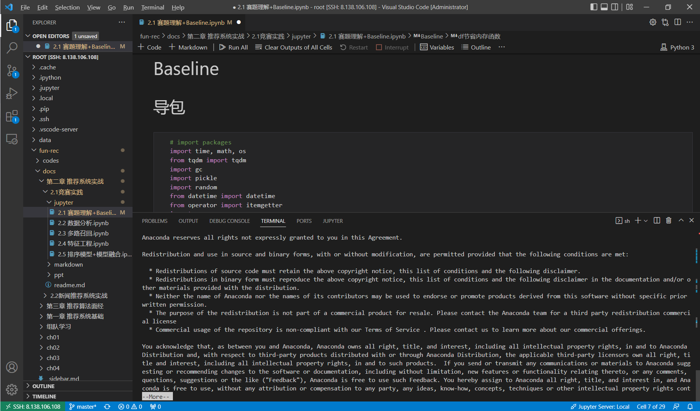

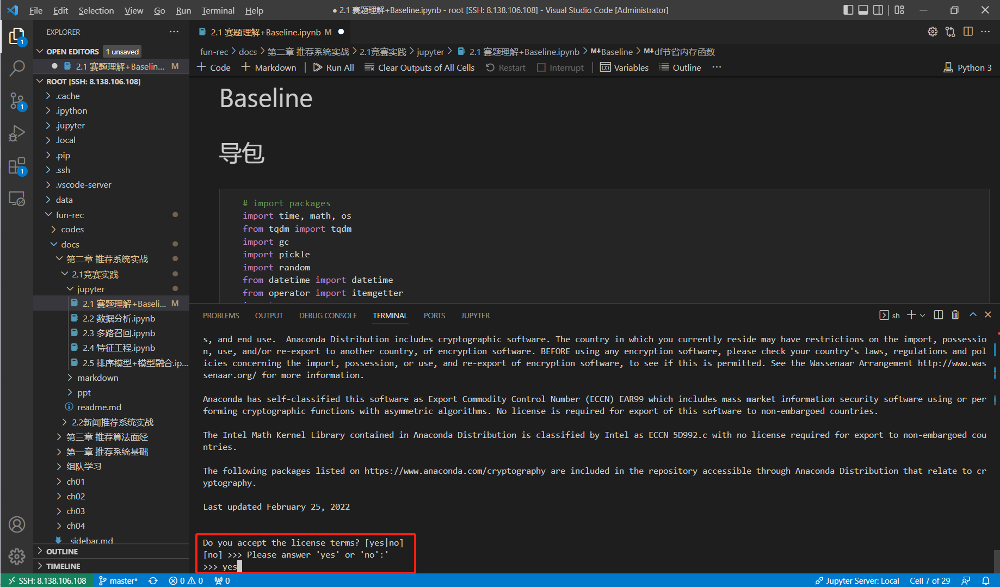

- 这里指定安装路径，我们保持默认就可以了，输入回车键。

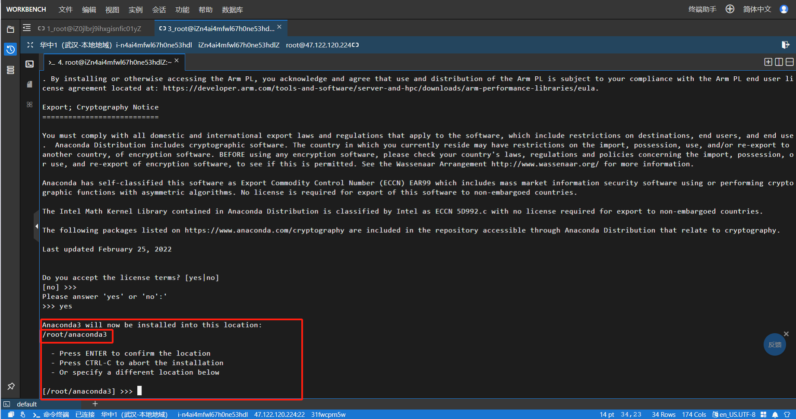

- 通常我们会来到这个页面，**强烈建议输入**`Yes`，如果你已经眼疾手快跳过了也没关系，接着往下看。

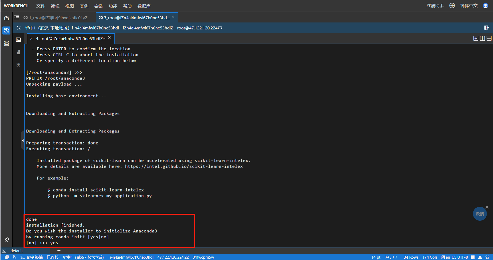

- 假如上一步已经填写了`Yes`直接跳过这一部分，如果没有输入或者输入了`No`则需要执行这一步。
- 正如我们在Windows安装软件需要添加`环境变量`，上一步相当于软件自动帮我们添加，假如错过了则需要我们手动进行添加，只不过流程也非常简单：

```Bash
# 映射路径
export PATH=$PATH:/root/anaconda3/bin/

# 启用环境
source ~/.bashrc

```

- 如果部署成功我们会看到前边的机器稍有变化，进入到了`base`环境也就是`conda`的环境大本营。
- 假如这一步没有显示`base`也请往下看。

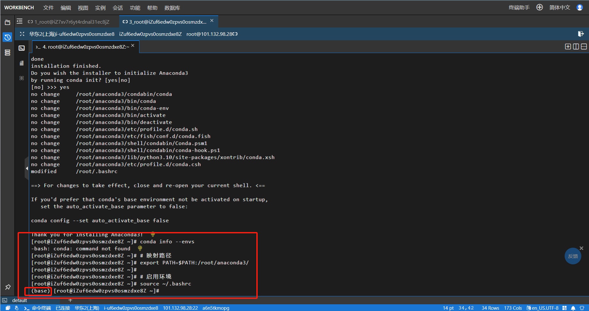

- **假如上一步失败**没有出现`base`你需要做如下简单的补救：

1.输入以下指令，我们通过VI编辑器来添加

```Bash
vi ~/.bashrc
```

- 假如见到这个界面，直接回车进入即可  

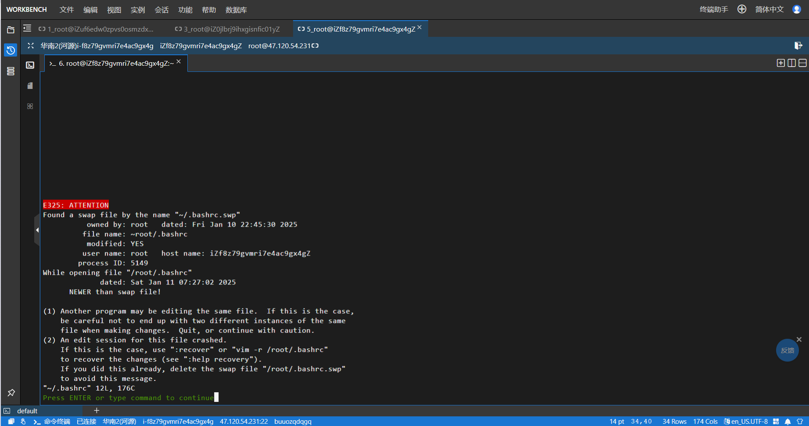

2.光标点进文档内部进入VI编辑器的`指令`编辑模式，键盘输入`i`指令（代表Insert）也就是准备输入的意思。

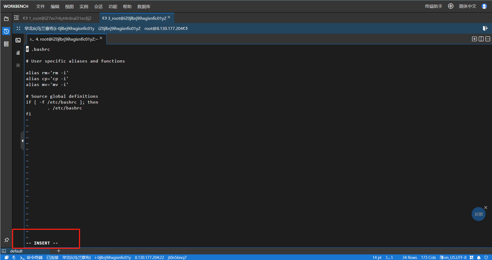

3.务必在上述`Insert`中才能够将内容输入： 

```Bash
export PATH=$PATH:/root/anaconda3/bin/
```

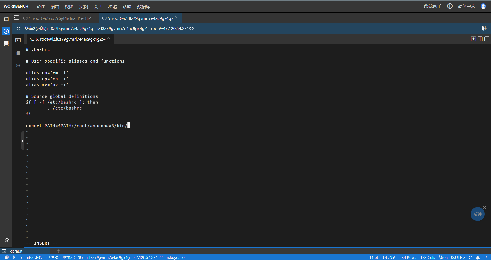

4.接着按住键盘左上角（通常）的`Esc`键退出`Insert`编辑模式，回到`指令`编辑模式；操作过程请选择英文输入法而非中文输入法。

5.此时在键盘输入`:wq`注意在此处的冒号，随后回车即代表“保存并退出”。 

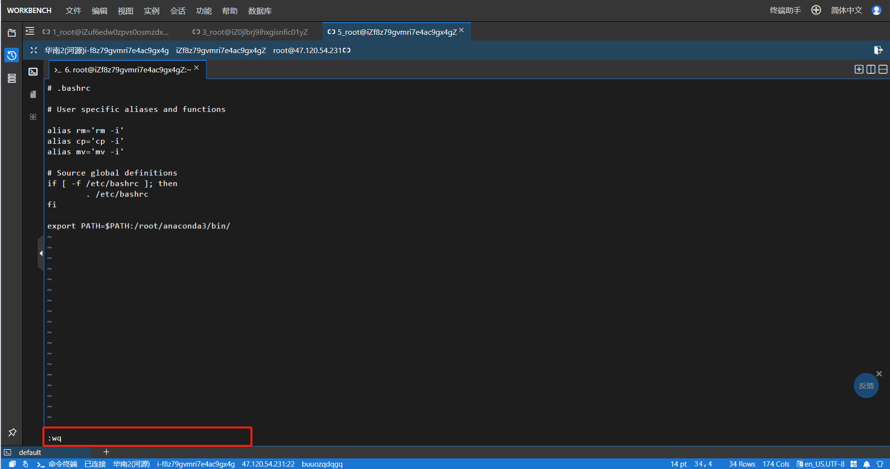

6.到这里代表我们手动把环境变量写入系统配置文件了，接下来我们还要让这个变量生效，运行下列代码：

```Bash
# 启用环境
source ~/.bashrc

# 初始化 conda 环境
conda init

```

7.这里提示我们进行重启，我们关闭当前终端重新打开（注意非重启开发机）到这里conda环境就彻底安装好啦！  

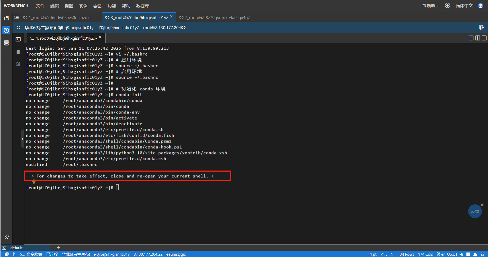

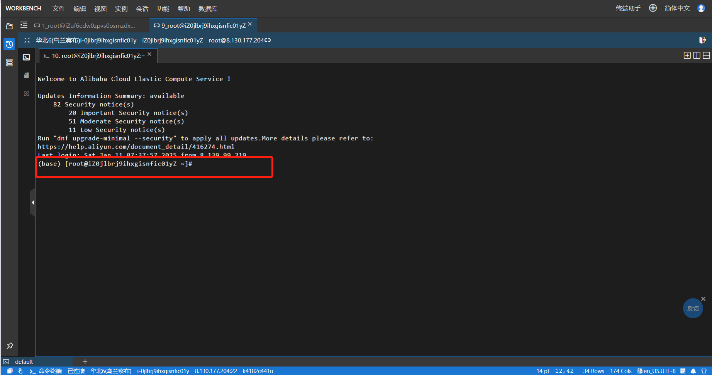

- 小概率情况，假如上一步失败没有看到base出现以下情况，我们这里继续补救下，已经看到的**直接跳过这部分**。

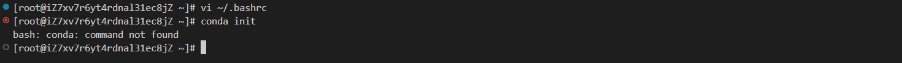

- 假如之前的配置没有成功，我们需要运行以下指令先把anaconda相关安装包删除掉，方便我们对其进行重新安装：

```Bash
# 切换到根目录
cd /root

# 删除安装包
rm -rf Anaconda3*

```

- 随后我们跳到最开始的【conda】部份重新走一遍安装流程，确保完成环境配置再往下进行。

8.到这里之前请确保你已经看到了`base`的环境字样。

9.最后一步是配置相关的源它可以让我们往后安装相关的Python库更加丝滑，这里推荐清华源；把下列代码在命令行框里边复制并运行。

```Bash
#添加镜像源
conda config --add channels https://mirrors.tuna.tsinghua.edu.cn/anaconda/pkgs/main
conda config --add channels https://mirrors.tuna.tsinghua.edu.cn/anaconda/pkgs/free
conda config --add channels https://mirrors.tuna.tsinghua.edu.cn/anaconda/pkgs/r
conda config --add channels https://mirrors.tuna.tsinghua.edu.cn/anaconda/pkgs/pro
conda config --add channels https://mirrors.tuna.tsinghua.edu.cn/anaconda/pkgs/msys2
 
#显示检索路径
conda config --set show_channel_urls yes
 
#显示镜像通道
conda config --show channels

```

- 看到这里就说明绝大部分环境工作已经完成啦！
- 到这里我们就把`Python管家`也就是`conda`安装好了，接下来就需要配置我们本次教程的专属环境啦。

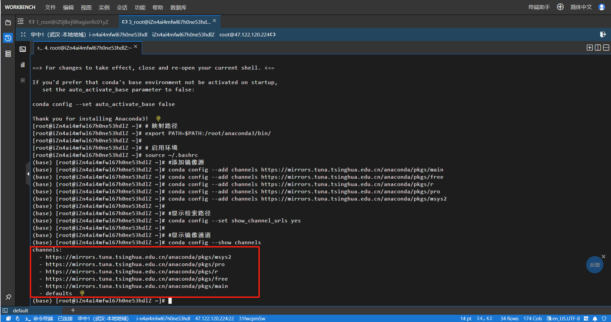

- ……
- **待补充【创建****conda** **环境，安装requirement】**

```Bash
# 创建环境，名为 fun-rec
conda create --name fun-rec python=3.8 -y

# 生效并进入该环境
conda activate fun-rec

# 安装相关的依赖包

```

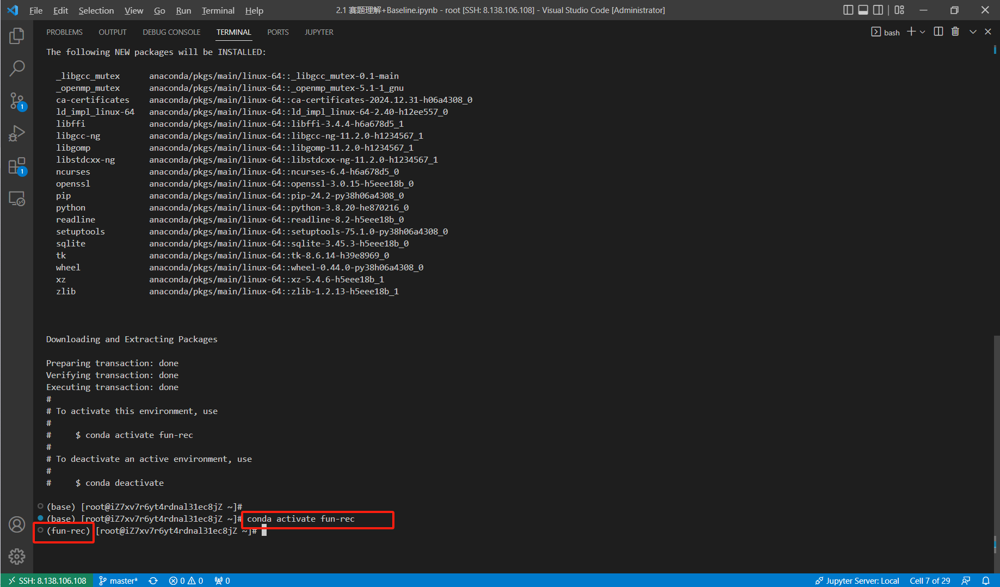

- 到这里我们已经把相关的依赖包都安装完成了，接着点击【Run All】就可以开始畅快玩耍啦!!!
- 到这里运行所需的环境就全都配置好了。但需要注意的是每当我们重新打开终端时，都会进入conda大本营也就是`base`环境，故我们在运行相关代码或者命令行输入指令前，都想要进入我们定义好的`fun-rec`才能生效。

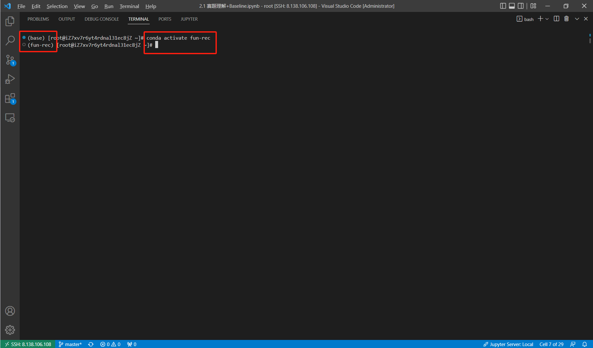

### Web

暂略


## 2.下载数据

```bash
mkdir data
wget http://tianchi-competition.oss-cn-hangzhou.aliyuncs.com/531842/articles.csv
wget http://tianchi-competition.oss-cn-hangzhou.aliyuncs.com/531842/articles_emb.csv
wget http://tianchi-competition.oss-cn-hangzhou.aliyuncs.com/531842/testA_click_log.csv
wget http://tianchi-competition.oss-cn-hangzhou.aliyuncs.com/531842/train_click_log.csv

```

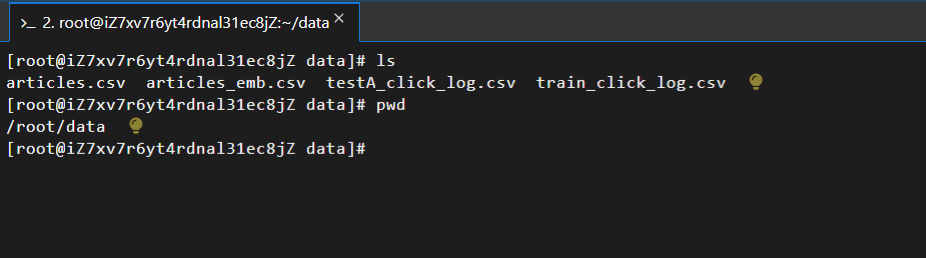