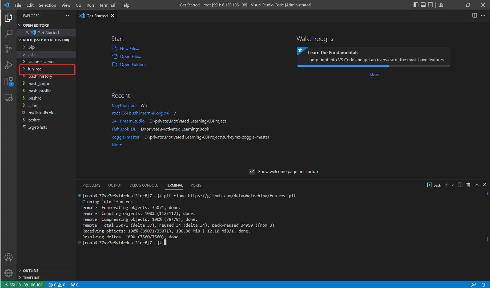

# fun-rec-tutorial
食用手册


# 更新日志


- 2025年1月10日  
环境配置（阿里ECS）+ Git仓库 + Data download操作说明


# Start

创建服务器

参考datwhale这篇：https://github.com/datawhalechina/llm-universe/blob/main/notebook/C1%20%E5%A4%A7%E5%9E%8B%E8%AF%AD%E8%A8%80%E6%A8%A1%E5%9E%8B%20LLM%20%E4%BB%8B%E7%BB%8D/5.%E9%98%BF%E9%87%8C%E4%BA%91%E6%9C%8D%E5%8A%A1%E5%99%A8%E7%9A%84%E5%9F%BA%E6%9C%AC%E4%BD%BF%E7%94%A8.md

安装git   
```bash
yum install git -y
```

进入Root路径克隆fun-rec仓库  
```
cd root
git clone https://github.com/datawhalechina/fun-rec.git
```



下载数据
```bash
mkdir data
wget http://tianchi-competition.oss-cn-hangzhou.aliyuncs.com/531842/articles.csv
wget http://tianchi-competition.oss-cn-hangzhou.aliyuncs.com/531842/articles_emb.csv
wget http://tianchi-competition.oss-cn-hangzhou.aliyuncs.com/531842/testA_click_log.csv
wget http://tianchi-competition.oss-cn-hangzhou.aliyuncs.com/531842/train_click_log.csv
```

[图片]
